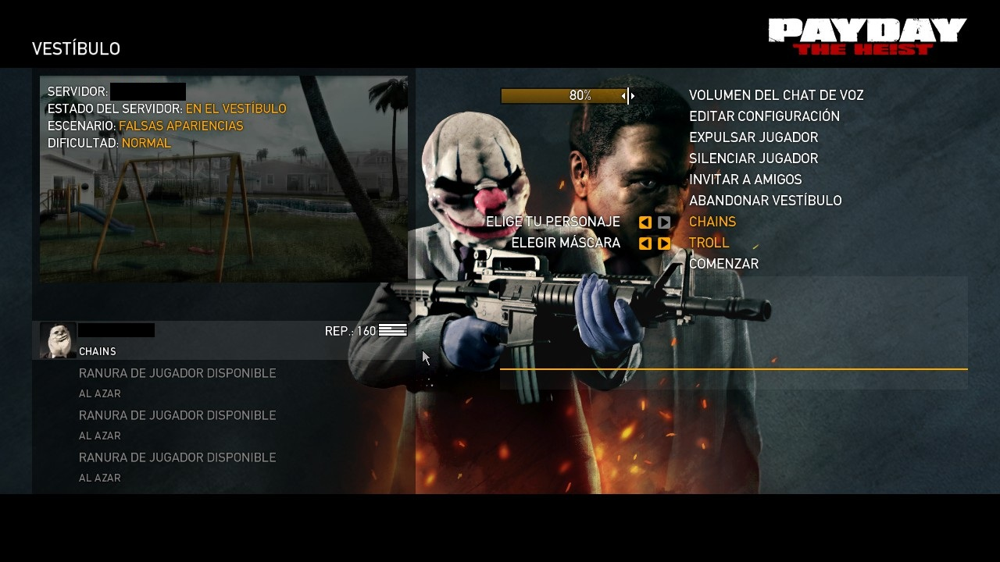
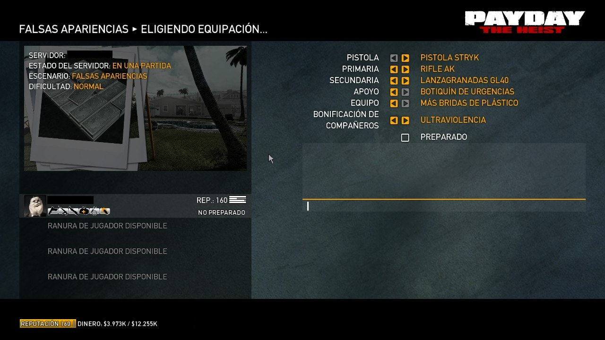

<h1>Tutorial | Desbloquear PDTH - Mask - DLC</h1>

    
    <h2>Desbloquear PDTH</h2>

<h3>Introduccion</h3>

Este tutorial te enseñará cómo desbloquear el DLC "The Wolf" en Payday: The Heist (PDTH). Asegúrate de seguir los pasos cuidadosamente para evitar problemas.

<h3>Requisitos</h3>
<ul>
    <li>PDTH instalado - Steam</li>
    <li>Acceso a la carpeta de instalación del juego</li>
    <li>Capacidad para seguir un tutorial</li>
</ul>

<h4>Nota:</h4>

Este tutorial no funciona para versiones de steam verde 🏴‍☠️<del>Esas versiones ya cuentan con el DLC</del>

<h3>Pasos para desbloquear el DLC - Mascaras</h3>
<ol>
    <li>Abre la carpeta de instalación del juego. Por lo general, se encuentra en <code>C:\Program Files (x86)\Steam\steamapps\common\Payday The Heist</code>.</li>
    <li>Descarga la carpeta de <code>archivos_necesarios</code>, ahi encontraras los siguientes archivos</li>
        <ul>
            <li><code>📄 IPHLPAPI.dll</code></li>
            <li><code>📄 PD2Hook.yml</code></li>
            <li>Dentro de la carpeta 📁<code>LTKBGooGoo</code> encontraras:</li>
            <li><code>📄 DLCUnlocker.lua</code></li>
            <li><code>📄 All_Mask.lua</code></li>
        </ul>
    </li>
    <li>Copia los archivos a la carpeta raiz de tu juego PDTH, copia los archivos tal cual, deja los archivos <code>.lua</code> dentro de la carpeta 📁<code>LTKBGooGoo</code></li>
    <li>Ejecuta el juego 🎮</li>
</ol>

<h4>Nota: 👀</h4>

Cuando ejecutes el juego aparecera esta advertencia, solo haz clic, en aceptar y el juego se ejecutara, y si esto no funciona ejecuta el juego como administrador

    
Advertencia de seguridad

    
Por defecto Windows elimina el archivo <code>IPHLPAPI.dll</code>

    
La solucion, excluye la carpeta raiz de tu juego payday the heist, de la seguridad de Windows

<h3>Preguntas Frecuentes:</h3>

    
¿Es un virus?

    
No es un virus, unicamente es una alteracion al juego, algo asi como un mod, y si no es virus ¿porque la exclusion del antivirus?, sencillo Windows detecta ciertos archivos con ciertas extenciones y las declara como no seguras y por ello windows elimina esos archivos.

    
¿Funciona en el online?

    
Funciona correctamente en el multijugador, incluido el DLC y las mascaras desbloqueadas.

    
¿Hay Ban?

    
El juego no te banea, ni nada por usar esta modificación, pues lo declara como mod y no como cheat.

    
¿Que mascaras incluye?

    
Incluye todas la mascaras, incluso las de soundtrak y las ocultas.

    

<h3>Capturas</h3>

        
Mascaras desbloqueadas

    
    

    

        
DLC The Wolf - Armas

        
    

<h3>Creditos</h3>

Todo este fue posible gracias a los scripts obtenidos de foros, creditos a sus respectivos autores. Disfruta del DLC y las Mascaras.

